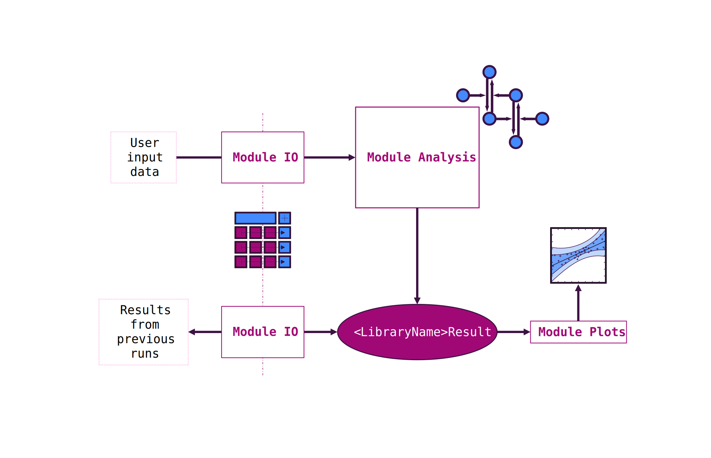

# The FsLab project template

A dotnet new template for creating streamlined datascience packages

The aim of this template is to provide a standardized way on how to package F# data science libraries that build on top of the FsLab toolbox.

The type of library this template is designed for typically does the following:

1. Reading data from the user input via [Deedle]() as a data frame. There might be preprocessing/mandatory formatting of the input.

2. Performing the transformations or analysis pipelines the library is designed for:
    - If you are for example publishing a new method with this template, write your functions so that they can work with data frame inputs.
    - You can either use projects from the FsLab toolbox where adequate or go your own way completely (which might be necessary to make your method work).

3. Return a `<MethodName>Result` type. This central result type is then used in your library for everything after applying the transformations and/or analysis pipelines.

4. Provide functions to write and read `<MethodName>Result` to/from disk

5. Provide functions to visualize `<MethodName>Result` using Plotly.NET

6. Provide documentation using the [fslab documentation template]()

In a more abstract way, here is what a library using this template should be designed to do:

## Library Scope

This template is mostly thought for 'single-purpose' data analysis libraries, e.g. to create a software package to accompany the paper about a method you just published. However, the concept of `IO` -> `Analysis` -> `Result` -> `Visualize/Write` should be pretty expandable to your needs.